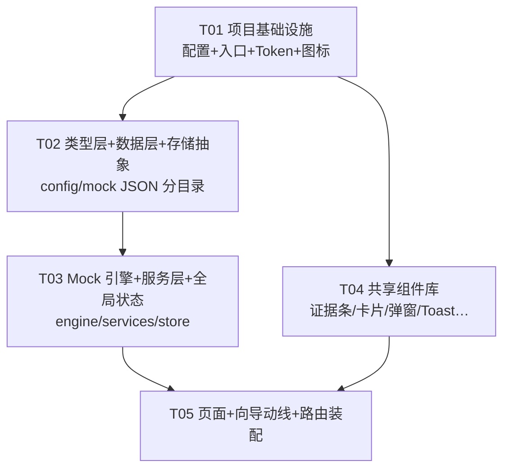

# 志愿帮 前端 V1.0 MVP — 系统设计文档（Architect: 高见远）

> 输入：`prd-gaokao-volunteer-engine-2026-09-23.md`（第 8/9/10 节）+ `志愿帮-首页原型.html`（青空薄荷 Token / 布局规格）
> 范围：仅前端 Web App（移动端优先），后端/真实 LLM/登录全部 mock。工程根目录：`F:\My_Project\AI解决方案专家\志愿填报APP\frontend\`

---

## Part A 系统设计

### 1. 技术栈选型 + 理由

**核心难点分析**：① 视觉 1:1 还原（原型是全自定义内联样式 + 青空薄荷 Token，重组件库必然打架）；② 第⑧步数据解耦要"现在就做对"（静态配置 vs 动态 mock 数据必须在目录与类型层面隔离）；③ 用户是学习者且 AI 禁止 npm install（工程必须一次成型、依赖极简、双击 .bat 即跑）；④ mock 引擎接口签名与将来 FastAPI 后端一致（async 服务层隔离）。

| 决策项 | 结论 | 理由 |
|---|---|---|
| 语言 | **TypeScript（严格模式）** | 明确选 TS。理由：a) 第⑧步要把"静态配置/动态数据"按类型分开核对，没有类型等于盲改；b) mock LLM 的请求/响应固定 JSON schema 是 PRD 9.3 的白名单防线，TS 类型即文档；c) 后端是 FastAPI（Pydantic），TS interface ↔ Pydantic model 一一对应，第⑩步接口对齐零翻译成本。学习者成本通过"类型文件只写 5 个、注释齐全"控制。 |
| 构建工具 | **Vite ^5** | Node 22 完全兼容；零配置即用；HMR 快。不选 webpack（配置重，学习者不友好）。 |
| 框架 | **React 18**（原型即为 React 18 单文件，直接平移） | 原型 HomeScreen/WizardScreen/PlanScreen 的结构与文案可逐段搬入组件，还原度最高。 |
| 路由 | **react-router-dom ^6.26** | 三 Tab + 独立向导流共 4 条路由（`/`、`/plan`、`/me`、`/wizard/:step`），用嵌套路由表达。不选 v7（API 变动大、教程少）。不引入 TanStack Router（过重）。 |
| 状态管理 | **Context + useReducer（零依赖）** | 全局状态只有一份 Draft（Profile + Preferences + step），规模小，reducer 天然是"动作→状态"纯函数，学习者可读性最好。**不引入 Zustand/Redux/RTK**——避免多余依赖与概念。 |
| 草稿持久化 | **存储抽象层 `storage/StorageAdapter` 接口 + LocalStorageAdapter 实现** | REQ-003 本期 localStorage，将来换云端只写一个 `CloudStorageAdapter`，业务代码零改动。草稿带 `version` 字段与 `updatedAt`。 |
| 样式 | **CSS Variables（tokens.css）+ 原生 CSS Modules** | 取舍结论：❌ Tailwind——原型全是自定义数值（66px 大数字、13px 圆角、非标准间距），Tailwind 任意值类名会造成还原偏差与类名噪音；❌ CSS-in-JS——运行时成本 + 学习者额外概念；❌ styled-components 同理。**✅ 方案：`tokens.css` 把原型 C 色板逐项转成 CSS 变量（`--c-sky` 等）+ 每组件一个 `.module.css`**，原型内联 style 可逐条机械翻译成 module CSS，1:1 还原且有全局改肤能力。 |
| 组件库 | **不引入**（MUI/AntD 全部不用） | 原型是全自定义视觉，重组件库的主题覆盖成本高于手写；且输入控件都很简单（数字输入/卡片/弹窗/Toast）。 |
| 图标 | **内联 SVG（`src/icons.tsx` 单文件）** | 沿用原型 IcHome/IcPlan/IcMe/IcChevron/IcBack 写法，不引 react-icons 等图标库。 |
| 图表 | **不引入**（配比条 = 4 个 div，概率区间 = 文本） | 首页四梯度条与方案页统计卡均为纯 div 实现，无需 ECharts。 |
| 日期 | **不引入**（倒计时 = `Date` 差值，目标日 2027-06-07） | dayjs 都不需要。 |
| Mock 引擎 | **`src/engine/` 纯函数模块 + `src/services/` async 门面** | engine 只 import 类型与 JSON，不碰 React；services 全部返回 `Promise`（模拟网络延迟 200-400ms），将来第⑩步把 services 内部换成 `fetch` 即可，页面与引擎代码不动。 |
| Mock 大模型 | **`services/llmService.ts`：关键词规则解析 + 1.2–2s 随机延迟 + 固定 schema 输出** | 输入命中期望地域/排斥地域/黑名单专业/权重关键词 → 返回 `LlmParseResponse{code:'OK', data}`；无命中 → `PARSE_FAILED`，前端回退表单（REQ-006 不阻塞）。schema 与将来直连后端完全一致。 |
| 数据组织 | **`data/config/`（静态配置）与 `data/mock/`(演示动态数据) 严格分目录** | config：省份模式、阈值口径、特殊身份清单（随代码发布，改了要回归）；mock：一分一段、候选库、去向示例、政策（将来由后端接口返回，改了不用回归引擎逻辑）。第⑧步只需"逐文件核对归属"，轻量完成。 |

**架构模式**：分层架构（types → data → engine → services → store → components → pages），单向数据流。无 MVC/MVVM 框架约束，保持 React 惯例。

### 2. 文件列表

```
frontend/
├── package.json                    # 依赖声明 + scripts（dev/build/preview）
├── vite.config.ts                  # Vite 配置（@ 别名、react 插件、server.port=5173）
├── tsconfig.json / tsconfig.node.json  # TS 严格模式配置
├── index.html                      # 入口 HTML（含 viewport、中文 title「志愿帮」、系统字体栈 meta）
├── .gitignore                      # node_modules/dist
├── README.md                       # 双击 .bat → npm install → npm run dev 使用说明 + 目录导览
└── src/
    ├── main.tsx                    # ReactDOM 入口，挂载 App
    ├── App.tsx                     # HashRouter 路由装配 + AppProvider + ToastProvider + 布局
    ├── icons.tsx                   # 全部内联 SVG 图标（IcHome/IcPlan/IcMe/IcChevron/IcBack/IcInfo…）
    ├── styles/
    │   ├── tokens.css              # 青空薄荷设计 Token（CSS 变量，来自原型 C 色板，见第 7 节清单）
    │   └── global.css              # reset、系统字体栈、.tap 触感反馈、.screen-in 进场动画、::selection
    ├── types/
    │   ├── profile.ts              # Profile / ProvinceConfig / SubjectCode / ElectiveSubject / SubScores
    │   ├── preference.ts           # Preferences / WeightPreset / TuneLevel / SchoolFloor
    │   ├── candidate.ts            # Candidate / Gradient / Evidence / Plan / GradientStat / DegradeStep
    │   ├── llm.ts                  # LlmParseRequest / LlmIntention / LlmParseResponse（将来直连后端 schema）
    │   └── draft.ts                # Draft（version/step/profile/preferences/updatedAt）
    ├── data/
    │   ├── config/                 # ★静态配置（第⑧步核对后接省配置表）
    │   │   ├── provinces.json      # 省份清单与模式（广东 online+3+1+2+45 志愿+院校专业组；其余 offline）
    │   │   ├── thresholds.json     # 概率阈值 40/75/95、基准配比 2:3:3:2、各预设×微调档配比表、降级顺序
    │   │   └── specialIdentities.json # 特殊身份选项（国家/地方/高校专项、强基、少数民族；艺体 hidden:true）
    │   └── mock/                   # ★演示动态数据（全部标注「演示数据」，将来由后端返回）
    │       ├── scoreRank.gd.json   # 广东物理/历史类一分一段示意映射 [分数,位次,超过百分比][]
    │       ├── candidates.gd.json  # 广东院校专业组候选库（~40 条：院校/组/专业/城市/层次/往年位次/计划数）
    │       ├── pastPlans.gd.json   # S2.5 往届同位次考生去向示例（按位次分档）
    │       └── policy.gd.json      # 特殊身份政策示意（省份适用性/加分值）
    ├── engine/                     # 纯函数，无 React 依赖（将来可直接复用于 Node 后端）
    │   ├── rankLookup.ts           # 一分一段线性插值反查：分数→{rank, percentile, source}
    │   ├── probability.ts          # 概率区间与梯度判定（冲<40%/稳40–75%/保75–95%/垫>95%，双模型交集）
    │   ├── blacklist.ts            # 黑名单硬过滤（返回 blocked 与 surviving，绝对不可放宽）
    │   ├── degrade.ts              # L1 放开院校层次下限 → L2 扩大地域（按固定顺序、全程明示）
    │   ├── completeness.ts         # 信息完整度评分（字段权重表驱动）
    │   ├── planBuilder.ts          # 编排：过滤→概率→梯度→黑名单→降级→按配比排序输出 Plan
    │   └── ratio.ts                # 预设×微调档 → 配比计算（读 thresholds.json）
    ├── services/                   # async 门面，模拟后端（第⑩步只改这一层）
    │   ├── provinceService.ts      # getProvinces(): Promise<ProvinceConfig[]>
    │   ├── rankService.ts          # lookupRank(province,track,score)：读 JSON→调 engine，含 300ms 延迟
    │   ├── candidateService.ts     # fetchCandidates(profile)：选科/批次过滤后的候选集
    │   ├── planService.ts          # buildPlan(profile,preferences)：调 planBuilder，返回 Plan+降级记录
    │   ├── llmService.ts           # parseIntention(text)：mock LLM（延迟 1.2–2s、schema 校验、失败回退）
    │   └── sampleService.ts        # fetchPastPlans(rank)：S2.5 粗结果示例
    ├── storage/
    │   ├── StorageAdapter.ts       # 接口：load()/save()/clear()（将来 CloudStorageAdapter 实现同一接口）
    │   ├── LocalStorageAdapter.ts  # localStorage 实现（try/catch 容错隐私模式）
    │   └── draftStore.ts           # 草稿序列化/版本迁移/防抖保存（500ms）
    ├── store/
    │   ├── AppContext.tsx          # AppProvider + useApp：Draft reducer（UPDATE_PROFILE/UPDATE_PREFS/GOTO_STEP/RESET）
    │   └── useToast.ts             # Toast 全局状态（消息+自动消失 1.9s，沿用原型时序）
    ├── components/                 # 共享组件（全部配 .module.css）
    │   ├── TabBar.tsx              # 底部三 Tab（首页/方案/我的），沿用原型视觉
    │   ├── StepHeader.tsx          # 向导顶栏：返回/步骤文案/渐变进度条/「全程可回改」提示
    │   ├── OptionCard.tsx          # 通用可选卡片（省份/选科/权重预设复用，选中态/灰态/勾标）
    │   ├── EvidenceBar.tsx         # 证据条（首页与方案页复用同一组件，可展开四类证据+原文引用）
    │   ├── GradientBar.tsx         # 冲稳保垫配比条（含图例，首页预览与方案统计复用）
    │   ├── CandidateCard.tsx       # 志愿卡：梯度角标+校名专业+概率区间+内嵌 EvidenceBar
    │   ├── Modal.tsx               # 通用弹窗（标题/正文/确认取消，二次确认与声明勾选复用）
    │   ├── Toast.tsx               # 底部浮层提示
    │   ├── ComplianceNote.tsx      # 合规标注组件（「本方案由规则引擎计算，仅供参考…」）
    │   └── Pill.tsx                # 信息胶囊标签（方案页顶部"广东省/物理类/598 分"等）
    ├── pages/
    │   ├── HomePage.tsx            # 首页 1:1 还原：Hero 倒计时+青空+CTA、断点续填卡、证据条示例、四梯度预览
    │   ├── PlanPage.tsx            # 方案页：档案胶囊、完整度提示、四梯度统计卡、志愿卡列表、合规标注
    │   ├── MePage.tsx              # 「我的」诚实占位页（原型 MeScreen 还原）
    │   └── wizard/
    │       ├── WizardLayout.tsx    # 向导壳：StepHeader + 按 :step 渲染子步骤 + 无效步骤重定向
    │       ├── Step1Location.tsx   # S1：省份卡片（广东上线/其余灰态）、首选单选、再选多选恰 2 门校验、回显确认条
    │       ├── Step2Score.tsx      # S2：总分输入（0–750、<100 二次确认弹窗）、单科折叠面板、位次反查证据、覆盖弹窗（>500 勾声明）
    │       ├── Step25Preview.tsx   # S2.5：往届同位次考生去向示例（先给价值再要信息）
    │       ├── Step3Preset.tsx     # S3：权重三选一卡片 + 三档微调面板（禁裸滑杆）+ 实时配比/分布预览
    │       ├── Step4Chat.tsx       # S4：对话式意向细化（mock LLM 解析→结构化确认卡→失败回退表单补填）
    │       ├── Step5Identity.tsx   # S5：特殊身份勾选卡（艺体隐藏）+ 信息完整度评分展示
    │       ├── BlacklistGate.tsx   # 黑名单拦截确认页：展示被拦截 N 个志愿，「移出黑名单/继续拦截」，不可绕过
    │       └── NoMatchDiagnosis.tsx # 候选=0 诊断页：说明致无解条件+放宽建议（禁止静默降级的配套）
    └── AppRouter 伪代码见 App.tsx   # 路由：/ →HomePage；/plan→PlanPage；/me→MePage；/wizard/:step(1..6)→WizardLayout
```

### 3. 数据结构与接口（核心 TS 类型）

```ts
/* ===== types/profile.ts ===== */
export type SubjectCode = '物理' | '历史';
export type ElectiveSubject = '化学' | '生物' | '地理' | '政治';
export interface ProvinceConfig {
  code: string;              // 'GD'
  name: string;              // '广东'
  online: boolean;           // false → 灰态「即将开放」
  mode: '3+1+2' | '3+3' | '文理';
  batchMode: '院校专业组' | '专业+院校' | '院校';
  volunteerLimit: number;    // 广东 45
  baseRatio: [number, number, number, number]; // 基准配比 [2,3,3,2]
}
export interface SubScores { 语文?: number; 数学?: number; 英语?: number; }
export interface Profile {
  province?: string;                 // ProvinceConfig.code
  track?: SubjectCode;
  electives: ElectiveSubject[];      // 恰好 2 门才合法
  totalScore?: number;               // 0–750
  subScores: SubScores;              // 留空项引擎忽略
  systemRank?: number;               // 系统反查位次（只读）
  systemPercentile?: number;         // 超过全省百分比
  rankOverride?: number;             // 手动覆盖位次
  rankOverrideConfirmed?: boolean;   // 偏差>500 时的声明勾选
  specialIdentities: string[];       // specialIdentities.json 的 id
}
export const isValidSubjectCombo = (c: ProvinceConfig, t: SubjectCode, e: ElectiveSubject[]) =>
  c.mode === '3+1+2' ? e.length === 2 : true;

/* ===== types/preference.ts ===== */
export type WeightPreset = '保专业' | '保学校' | '保城市';
export type TuneLevel = 0 | 1 | 2;   // 微调三档：0 标准 / 1 偏向 / 2 强偏向（禁止裸滑杆）
export type SchoolFloor = '不限' | '公办' | '双一流' | '211' | '985';
export interface Preferences {
  weightPreset?: WeightPreset;       // S3 必选其一
  tune: TuneLevel;
  expectedRegions: string[];         // 期望地域（含经济圈标签展开）
  excludedRegions: string[];         // 排斥地域
  majorBlacklist: string[];          // 专业黑名单（一级学科大类，绝对约束）
  schoolFloor: SchoolFloor;
  ownership: '不限' | '公办' | '民办';
}

/* ===== types/candidate.ts ===== */
export type Gradient = '冲' | '稳' | '保' | '垫';
export interface Evidence {
  pastRanks: string;      // "23,800–26,500（2023–2025）"
  peerCount: string;      // "412 人"
  planCount: string;      // "86 人 · 较去年 +8%"
  factors: string;        // "位次正态 μ25,100/σ1,900 ∩ 历史频率 61%"（决策#7：公式因子级公开）
  source: string;         // "2025 年广东省一分一段表 · …（演示数据）"
}
export interface Candidate {
  id: string;
  school: string; majorGroup: string; major: string; city: string; province: string;
  tier: '985' | '211' | '双一流' | '公办' | '民办';
  majorsInGroup: string[];           // 组内专业（黑名单按大类匹配用）
  probability: [number, number];     // 置信区间，如 [52, 68]
  gradient: Gradient;
  confidence: number;                // 0–100
  tags: string[];                    // 如 ['无历史数据·估算']
  evidence: Evidence;
}
export type DegradeStep = { level: 'L1' | 'L2'; desc: string };  // 全程明示，禁止静默
export interface Plan {
  candidates: Candidate[];
  gradientStats: Record<Gradient, number>;
  ratio: [number, number, number, number];   // 实际使用配比
  blacklistBlocked: number;                  // 被拦截志愿数（BlacklistGate 展示）
  degraded: DegradeStep[];
  completeness: number;                      // 0–100
  isEstimate: boolean;                       // 候选=0 → NoMatchDiagnosis
  noMatchReasons: string[];
}

/* ===== types/llm.ts =====（将来直连 FastAPI 的请求/响应 schema，字段不再变） */
export interface LlmParseRequest { text: string; province?: string; preset?: WeightPreset; }
export interface LlmIntention {
  expectedRegions: string[]; excludedRegions: string[];
  majorBlacklist: string[]; weightPreset?: WeightPreset;
}
export interface LlmParseResponse {
  code: 'OK' | 'PARSE_FAILED' | 'TIMEOUT';
  data?: LlmIntention;   // code==='OK' 时必有；过枚举白名单校验后使用
  message?: string;
}

/* ===== types/draft.ts ===== */
export interface Draft {
  version: 1;
  step: number;                      // 1–6（6=黑名单确认页）
  profile: Profile;
  preferences: Preferences;
  updatedAt: string;                 // ISO 8601 UTC
}

/* ===== storage/StorageAdapter.ts =====（REQ-003 抽象，将来云端直换实现） */
export interface StorageAdapter {
  load(): Promise<Draft | null>;
  save(draft: Draft): Promise<void>;
  clear(): Promise<void>;
}

/* ===== engine/ 关键签名（mock 引擎 = 将来后端接口签名） ===== */
export function rankLookup(score: number, table: RankRow[], yearLabel: string): RankResult | null;
export function classifyGradient(p: number): Gradient;   // p 为位次百分位
export function filterBlacklist(cands: Candidate[], blacklist: string[]): { blocked: Candidate[]; surviving: Candidate[] };
export function degrade(cands: Candidate[], prefs: Preferences, min: number): { candidates: Candidate[]; steps: DegradeStep[] };
export function buildPlan(profile: Profile, prefs: Preferences, pool: Candidate[]): Plan;
```

### 4. 程序调用流程（时序图见 `docs/sequence-diagram.mermaid`）

关键流程：输入→草稿→引擎→方案。类图见 `docs/class-diagram.mermaid`。

### 5. 待明确事项

1. **历史类一分一段数据**：原型演示数据为物理类口径；`scoreRank.gd.json` 中历史类映射表需单独一份示意数据（工程师按同结构造演示值即可，标注「演示数据」）。
2. **S4 mock 解析关键词覆盖范围**：V1 只覆盖「地域（省份/大湾区/江浙沪等）+ 专业大类（医学/师范/法学等）+ 权重词（保专业/学校/城市）」，更细的自然语言理解留给真实大模型。
3. **经济圈标签**（大湾区/江浙沪）展开为具体城市的映射表放在 `provinces.json` 附属字段，具体成员城市口径待产品确认，先按常见口径示意。
4. 其余无阻塞：概率双模型交集在 mock 阶段简化为「位次正态主模型 + 历史频率因子展示」（与原型证据条文案一致），真实公式留待第⑩步。

---

## Part B 任务分解

### 6. 依赖包列表

```
dependencies:
- react@^18.3.1                    # UI 框架（原型同版本系）
- react-dom@^18.3.1                # React 渲染器
- react-router-dom@^6.26.2         # 路由（三 Tab + 向导流）

devDependencies:
- vite@^5.4.8                      # 构建工具
- @vitejs/plugin-react@^4.3.2      # Vite React 插件（JSX/Fast Refresh）
- typescript@^5.6.2                # 类型系统
- @types/react@^18.3.11            # React 类型
- @types/react-dom@^18.3.1         # ReactDOM 类型
```

共 3 个运行时依赖，每个均已说明用途。**刻意不引入**：组件库、Tailwind、CSS-in-JS、状态库、图标库、图表库、日期库（理由见第 1 节）。

### 7. 任务列表（≤5 个，工程师一个 turn 批量完成）

| Task ID | 任务名 | Source Files | 依赖 | 优先级 |
|---|---|---|---|---|
| **T01** | 项目基础设施（配置+入口+设计 Token） | `package.json`, `vite.config.ts`, `tsconfig.json`, `tsconfig.node.json`, `index.html`, `.gitignore`, `README.md`, `src/main.tsx`, `src/App.tsx`(先骨架), `src/styles/tokens.css`, `src/styles/global.css`, `src/icons.tsx` | 无 | P0 |
| **T02** | 类型层 + 数据层 + 存储抽象（第⑧步边界的地基） | `src/types/` 全部 5 个文件, `src/data/config/provinces.json`, `src/data/config/thresholds.json`, `src/data/config/specialIdentities.json`, `src/data/mock/scoreRank.gd.json`, `src/data/mock/candidates.gd.json`, `src/data/mock/pastPlans.gd.json`, `src/data/mock/policy.gd.json`, `src/storage/StorageAdapter.ts`, `src/storage/LocalStorageAdapter.ts`, `src/storage/draftStore.ts` | T01 | P0 |
| **T03** | Mock 引擎 + 服务层 + 全局状态 | `src/engine/rankLookup.ts`, `src/engine/probability.ts`, `src/engine/blacklist.ts`, `src/engine/degrade.ts`, `src/engine/completeness.ts`, `src/engine/ratio.ts`, `src/engine/planBuilder.ts`, `src/services/` 全部 6 个文件, `src/store/AppContext.tsx`, `src/store/useToast.ts` | T02 | P0 |
| **T04** | 共享组件库（含证据条复用件） | `src/components/` 全部 10 个组件 + 对应 `.module.css`（TabBar/StepHeader/OptionCard/EvidenceBar/GradientBar/CandidateCard/Modal/Toast/ComplianceNote/Pill） | T01, T03 | P0 |
| **T05** | 页面 + 向导动线 + 路由装配收尾 | `src/pages/HomePage.tsx`, `src/pages/PlanPage.tsx`, `src/pages/MePage.tsx`, `src/pages/wizard/` 全部 9 个文件, `src/App.tsx`(最终路由装配) | T03, T04 | P0 |

> T01–T05 共 ~45 个文件，依赖为严格线性链（T02→T03→T05 有类型与状态依赖），按序一个 turn 写完即可 `npm install && npm run dev` 运行。

### 8. 共享知识（工程师必读）

**命名约定**
- 组件文件 PascalCase（`EvidenceBar.tsx`），hook `useXxx`，其余模块 camelCase；CSS Modules 与组件同名（`EvidenceBar.module.css`），类名 camelCase。
- JSON 数据文件命名：静态配置 `*.json`（config/），演示数据 `*.gd.json`（mock/）。
- 引擎函数必须纯函数：相同入参必出相同结果，禁止 `Date.now()`/随机数进入 engine（延迟只在 services 层加）。

**设计 Token（CSS 变量清单，源自原型 C 色板，写入 `tokens.css`）**
```
--c-sky:#2D9CDB      主色/CTA/「稳」    --c-sky-deep:#1B6FA8  深强调
--c-sky-ink:#0E4C77  标题强调          --c-mint:#27C493      草稿恢复/「保」
--c-mint-deep:#159B70                  --c-bg:#F4FAFD        页面底色
--c-card:#FFFFFF                       --c-ink:#16324A       正文
--c-sub:#5B7A94    次要文字            --c-line:#DCEBF5      分隔线
--c-rush:#FF9F43   「冲」              --c-stable:#2D9CDB    「稳」
--c-safe:#27C493   「保」              --c-base:#7C9CBF      「垫」
补充变量：--c-danger:#D9534F（校验标红）--c-disabled:#B9CFDF（置灰按钮）--c-faint:#93A9BC
字体：--font-sys: -apple-system, BlinkMacSystemFont, "PingFang SC", "Hiragino Sans GB", "Microsoft YaHei", "Segoe UI", sans-serif（禁止在线字体）
布局规格：页边距 20–24px；卡片间距 14–16px；圆角卡片 14 / 按钮 15；数字一律 font-variant-numeric: tabular-nums；正文 ≥12.5px
动效：.screen-in 进场（0.3s cubic-bezier(.22,.8,.36,1)）；.tap 按压 scale(.965)
```

**JSON 数据文件约定**
- `config/` = 随代码发布的静态配置（省份模式、阈值、身份清单）；`mock/` = 将来由后端返回的动态演示数据。第⑧步只做目录归属核对。
- 字段口径（写进 `thresholds.json`，禁止硬编码在任何 ts 里）：概率阈值 冲<40 / 稳40–75 / 保75–95 / 垫>95；基准配比 冲:稳:保:垫 = 2:3:3:2；广东 45 个平行志愿；L1→L2 降级顺序固定；黑名单绝对不可放宽。
- 所有 `mock/` 数据在 UI 上必须带「演示数据」或「示意」字样。

**Mock LLM 约定**：`llmService.parseIntention` 延迟 1200–2000ms 随机；关键词规则匹配 → `LlmIntention`；无命中返回 `PARSE_FAILED`；输出必须过白名单校验（地域/专业枚举来自 JSON），**数字类输出一律拒绝**（PRD 9.3 防线）。

**合规红线（硬约束）**
1. 方案页与所有含方案的输出必须带 `ComplianceNote`：「本方案由规则引擎计算，仅供参考，以广东省考试院官方公布为准」。
2. 全站禁止出现「保录取 / 确保上线 / 百分百 / 内部渠道 / 官方合作」类话术。
3. 概率只以「区间」表述，不承诺结果。
4. 黑名单拦截页不可绕过；降级（L1/L2）必须全程明示；候选=0 必须出诊断页，禁止静默。

**Wizard 步骤 ↔ 路由映射**：`/wizard/1` S1定位 → `/wizard/2` S2分数+反查 → `/wizard/2.5`（并入 step 2 的提交后状态，路由仍为 2→3 之间，实现为 `/wizard/3` 前的内部页面）→ 实际路由定为 `/wizard/:step`，step ∈ {1,2,3,4,5,6}，其中 S2.5 = step 3 顶部展示段、黑名单确认页 = step 6、方案生成后跳 `/plan`。每步回退仅 `navigate(-1)` 或点击步骤条，草稿即时 dispatch + 防抖落盘。

### 9. 任务依赖图


